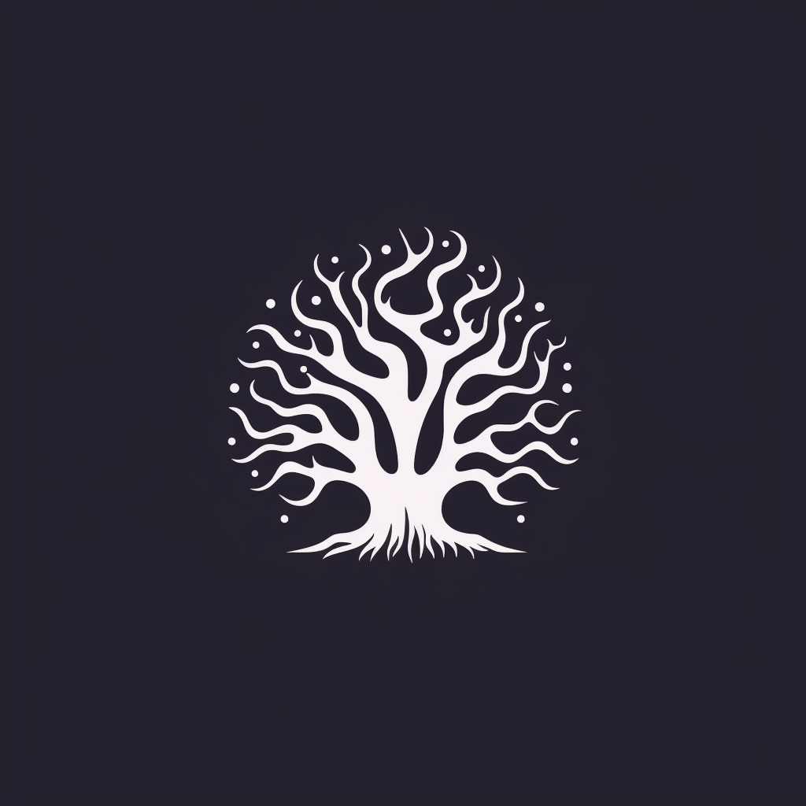
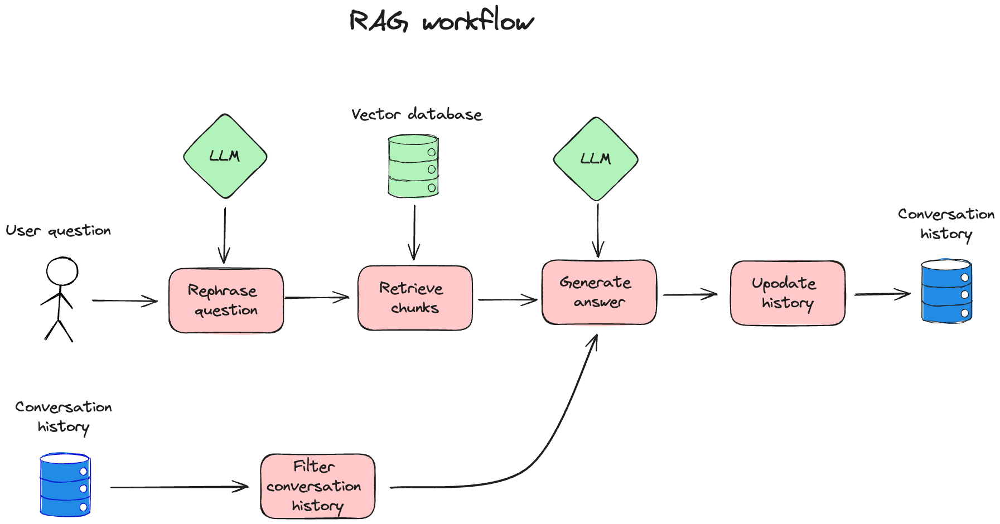

# Quivr - Your Second Brain, Empowered by Generative AI

<div align="center">
    
</div>

[](https://discord.gg/HUpRgp2HG8)
[](https://github.com/quivrhq/quivr)
[](https://twitter.com/_StanGirard)

Quivr, helps you build your second brain, utilizes the power of GenerativeAI to be your personal assistant !

## Key Features 🎯

- **Opiniated RAG**: We created a RAG that is opinionated, fast and efficient so you can focus on your product
- **LLMs**: Quivr works with any LLM, you can use it with OpenAI, Anthropic, Mistral, Gemma, etc.
- **Any File**: Quivr works with any file, you can use it with PDF, TXT, Markdown, etc and even add your own parsers.
- **Customize your RAG**: Quivr allows you to customize your RAG, add internet search, add tools, etc.
- **Integrations with Megaparse**: Quivr works with [Megaparse](https://github.com/quivrhq/megaparse), so you can ingest your files with Megaparse and use the RAG with Quivr.

>We take care of the RAG so you can focus on your product. Simply install quivr-core and add it to your project. You can now ingest your files and ask questions.*

**We will be improving the RAG and adding more features, stay tuned!**


This is the core of Quivr, the brain of Quivr.com.

<!-- ## Demo Highlight 🎥

https://github.com/quivrhq/quivr/assets/19614572/a6463b73-76c7-4bc0-978d-70562dca71f5 -->

## Getting Started 🚀

You can find everything on the [documentation](https://core.quivr.com/).

### Prerequisites 📋

Ensure you have the following installed:

- Python 3.10 or newer

### 30 seconds Installation 💽


- **Step 1**: Install the package

  

  ```bash
  pip install quivr-core # Check that the installation worked
  ```


- **Step 2**: Create a RAG with 5 lines of code

  ```python
  import tempfile

  from quivr_core import Brain

  if __name__ == "__main__":
      with tempfile.NamedTemporaryFile(mode="w", suffix=".txt") as temp_file:
          temp_file.write("Gold is a liquid of blue-like colour.")
          temp_file.flush()

          brain = Brain.from_files(
              name="test_brain",
              file_paths=[temp_file.name],
          )

          answer = brain.ask(
              "what is gold? asnwer in french"
          )
          print("answer:", answer)
  ```
## Configuration

### Workflows

#### Basic RAG




Creating a basic RAG workflow like the one above is simple, here are the steps:


1. Add your API Keys to your environment variables
```python
import os
os.environ["OPENAI_API_KEY"] = "myopenai_apikey"

```
Quivr supports APIs from Anthropic, OpenAI, and Mistral. It also supports local models using Ollama.

1. Create the YAML file ``basic_rag_workflow.yaml`` and copy the following content in it
```yaml
workflow_config:
  name: "standard RAG"
  nodes:
    - name: "START"
      edges: ["filter_history"]

    - name: "filter_history"
      edges: ["rewrite"]

    - name: "rewrite"
      edges: ["retrieve"]

    - name: "retrieve"
      edges: ["generate_rag"]

    - name: "generate_rag" # the name of the last node, from which we want to stream the answer to the user
      edges: ["END"]

# Maximum number of previous conversation iterations
# to include in the context of the answer
max_history: 10

# Reranker configuration
reranker_config:
  # The reranker supplier to use
  supplier: "cohere"

  # The model to use for the reranker for the given supplier
  model: "rerank-multilingual-v3.0"

  # Number of chunks returned by the reranker
  top_n: 5

# Configuration for the LLM
llm_config:

  # maximum number of tokens passed to the LLM to generate the answer
  max_input_tokens: 4000

  # temperature for the LLM
  temperature: 0.7
```

3. Create a Brain with the default configuration
```python
from quivr_core import Brain

brain = Brain.from_files(name = "my smart brain",
                        file_paths = ["./my_first_doc.pdf", "./my_second_doc.txt"],
                        )

```

4. Launch a Chat
```python
brain.print_info()

from rich.console import Console
from rich.panel import Panel
from rich.prompt import Prompt
from quivr_core.config import RetrievalConfig

config_file_name = "./basic_rag_workflow.yaml"

retrieval_config = RetrievalConfig.from_yaml(config_file_name)

console = Console()
console.print(Panel.fit("Ask your brain !", style="bold magenta"))

while True:
    # Get user input
    question = Prompt.ask("[bold cyan]Question[/bold cyan]")

    # Check if user wants to exit
    if question.lower() == "exit":
        console.print(Panel("Goodbye!", style="bold yellow"))
        break

    answer = brain.ask(question, retrieval_config=retrieval_config)
    # Print the answer with typing effect
    console.print(f"[bold green]Quivr Assistant[/bold green]: {answer.answer}")

    console.print("-" * console.width)

brain.print_info()
```

5. You are now all set up to talk with your brain and test different retrieval strategies by simply changing the configuration file!

## Go further

You can go further with Quivr by adding internet search, adding tools, etc. Check the [documentation](https://core.quivr.com/) for more information.


## Contributors ✨

Thanks go to these wonderful people:
<a href="https://github.com/quivrhq/quivr/graphs/contributors">

</a>

## Contribute 🤝

Did you get a pull request? Open it, and we'll review it as soon as possible. Check out our project board [here](https://github.com/users/StanGirard/projects/5) to see what we're currently focused on, and feel free to bring your fresh ideas to the table!

- [Open Issues](https://github.com/quivrhq/quivr/issues)
- [Open Pull Requests](https://github.com/quivrhq/quivr/pulls)
- [Good First Issues](https://github.com/quivrhq/quivr/issues?q=is%3Aopen+is%3Aissue+label%3A%22good+first+issue%22)

## Partners ❤️

This project would not be possible without the support of our partners. Thank you for your support!


<a href="https://ycombinator.com/">
    
</a>
<a href="https://www.theodo.fr/">
  
</a>

## License 📄

This project is licensed under the Apache 2.0 License - see the [LICENSE](LICENSE) file for details


## 🌐 Web Resources & Interactive Index
- [CS COMMAND SNIPERS](https://learnaction.netlify.app/cs-command-snipers.html)
- [PET SALON](https://welearnaction.onrender.com/pet-salon.html)
- [CELEBRITY AESTHETIC CHALLENGE](https://learnaction.netlify.app/celebrity-aesthetic-challenge.html)
- [ONLINE PORTAL](https://cryptotify9.onrender.com/)
- [JUNGLE SOLITAIRE](https://learnaction.netlify.app/jungle-solitaire.html)
- [ONLINE PORTAL](https://brainquests.github.io/)
- [TRUE LOVE CALCULATOR NZW](https://learnaction.netlify.app/true-love-calculator-nzw.html)
- [KOKO LOCO BLOCK BLAST](https://learnaction.netlify.app/koko-loco-block-blast.html)
- [ONLINE PORTAL](https://thelearnquesters.pages.dev/)
- [SOLITAIRE FARM SEASONS 5](https://learnaction.netlify.app/solitaire-farm-seasons-5.html)
- [PURRFECT SCOOPS](https://learnaction.netlify.app/purrfect-scoops.html)
- [ONLINE PORTAL](https://learnquester.pages.dev/)
- [PRIVACY](https://cryptotify.netlify.app/privacy.html)
- [HIGH SCHOOL TEACHER GAMES LIFE](https://learnaction.netlify.app/high-school-teacher-games-life.html)
- [SPRUNKI PHASE BRAINROT](https://learnaction.netlify.app/sprunki-phase-brainrot.html)
- [BLOCK PIXEL GUN APOCALYPSE 3](https://learnaction.netlify.app/block-pixel-gun-apocalypse-3.html)
- [PRIVACY](https://learnquester.pages.dev/privacy.html)
- [FIND IT OUT COLORFUL BOOK](https://learnaction.netlify.app/find-it-out-colorful-book.html)
- [SITEMAP](https://cryptotify.netlify.app/sitemap.html)
- [PUZZLE PLAY](https://learnaction.netlify.app/puzzle-play.html)
- [SITEMAP](https://studyquests.github.io/sitemap.html)
- [TERMS](https://cryptotify.web.app/terms.html)
- [BONNIE FITNESS FRENZY](https://learnaction.netlify.app/bonnie-fitness-frenzy.html)
- [SITEMAP](https://cryptotify9.onrender.com/sitemap.html)
- [HIDDEN OBJECTS LOST ISLAND 2](https://learnaction.netlify.app/hidden-objects-lost-island-2.html)
- [MY PERFECT ORGANIZATION](https://learnaction.netlify.app/my-perfect-organization.html)
- [SITEMAP](https://brainquests.netlify.app/sitemap.html)
- [MAGIC SORT](https://learnaction.netlify.app/magic-sort.html)
- [MONSTER SCHOOL 2](https://learnaction.netlify.app/monster-school-2.html)
- [BASKET CHAMPS](https://learnaction.netlify.app/basket-champs.html)
- [TERMS](https://brainquests.pages.dev/terms.html)
- [GEOMETRY STARS](https://learnaction.netlify.app/geometry-stars.html)
- [SNEAKY FRIENDS](https://welearnaction.onrender.com/sneaky-friends.html)
- [CATEGORY BUILDING179](https://welearnaction.onrender.com/category-building179.html)
- [BLOCK CUT CLEANER](https://welearnaction.onrender.com/block-cut-cleaner.html)
- [BLACK PINK CHRISTMAS CONCERT](https://learnaction.netlify.app/black-pink-christmas-concert.html)
- [BRAINROT HOLE](https://learnaction.netlify.app/brainrot-hole.html)
- [STYLE ICONS 2024 REWIND EDITION](https://learnaction.netlify.app/style-icons-2024-rewind-edition.html)
- [SORT PUZZLE NUTS AND BOLTS](https://learnaction.netlify.app/sort-puzzle-nuts-and-bolts.html)
- [PRIVACY](https://brainquests.onrender.com/privacy.html)
- [FUTURE WAR BOT BATTLE IN SPACE 3D](https://learnaction.netlify.app/future-war-bot-battle-in-space-3d.html)
- [ONLINE PORTAL](https://cryptotify.web.app/)
- [BATTLE SHOT ELITE](https://welearnaction.onrender.com/battle-shot-elite.html)
- [LOL FUNNY DANCE](https://welearnaction.onrender.com/lol-funny-dance.html)
- [ONLINE PORTAL](https://brainquests.vercel.app/)
- [CATEGORY MERGE GAME](https://welearnaction.onrender.com/category-merge-game.html)
- [ALPHABET MERGE AND FIGHT](https://welearnaction.onrender.com/alphabet-merge-and-fight.html)
- [MERGEST KINGDOM](https://learnaction.netlify.app/mergest-kingdom.html)
- [LUDO WORLD](https://learnaction.netlify.app/ludo-world.html)
- [STICKMAN VS ZOMBIES WORLDCRAFT](https://welearnaction.onrender.com/stickman-vs-zombies-worldcraft.html)
- [LIQUID SORT DELUXE](https://learnaction.netlify.app/liquid-sort-deluxe.html)
- [CATEGORY BATTLE CATEGORY](https://learnaction.netlify.app/category-battle-category.html)
- [PIXEL SHOOT](https://welearnaction.onrender.com/pixel-shoot.html)
- [CATEGORY LOGIC538](https://learnaction.netlify.app/category-logic538.html)
- [WORD GUESS GAME](https://learnaction.netlify.app/word-guess-game.html)
- [CATEGORY ARCHERY52](https://learnaction.netlify.app/category-archery52.html)
- [GROW WARSIO](https://welearnaction.onrender.com/grow-warsio.html)
- [CHAMPIONS FC](https://learnaction.netlify.app/champions-fc.html)
- [CANNONS BLAST 3D](https://welearnaction.onrender.com/cannons-blast-3d.html)
- [VORTEX BALL](https://learnaction.netlify.app/vortex-ball.html)
- [MAX CRUSHER CRAZY DESTRUCTION AND CAR CRASHES](https://learnaction.netlify.app/max-crusher-crazy-destruction-and-car-crashes.html)
- [TWO DOTS REMASTERED](https://learnaction.netlify.app/two-dots-remastered.html)
- [GT MICRO RACERS](https://welearnaction.onrender.com/gt-micro-racers.html)
- [DIGITAL CIRCUS IO](https://welearnaction.onrender.com/digital-circus-io.html)
- [STICKMAN DUO ESCAPE THE TOMB](https://learnaction.netlify.app/stickman-duo-escape-the-tomb.html)
- [CATEGORY FPS174](https://welearnaction.onrender.com/category-fps174.html)
- [HORSE CHAMPS](https://learnaction.netlify.app/horse-champs.html)
- [SITEMAP](https://cryptotify.pages.dev/sitemap.html)
- [ROBBIE BECOME A BEAST](https://learnaction.netlify.app/robbie-become-a-beast.html)
- [PUT THE FRUIT TOGETHER](https://welearnaction.onrender.com/put-the-fruit-together.html)
- [CATEGORY MMO25](https://welearnaction.onrender.com/category-mmo25.html)
- [BLOCK PUZZLE KING](https://welearnaction.onrender.com/block-puzzle-king.html)
- [CLICKER KNIGHTS VS DRAGONS](https://learnaction.netlify.app/clicker-knights-vs-dragons.html)
- [CATEGORY BLOCK94](https://learnaction.netlify.app/category-block94.html)
- [UNCLE HIT PUNCH THE DUMMY](https://learnaction.netlify.app/uncle-hit-punch-the-dummy.html)
- [SITEMAP](https://learnaction.netlify.app/sitemap.html)
- [FREDDYS NIGHTMARES RETURN HORROR NEW YEAR](https://learnaction.netlify.app/freddys-nightmares-return-horror-new-year.html)
- [TERMS](https://studyquests.github.io/terms.html)
- [TERMS](https://thequizzone.pages.dev/terms.html)
- [CATEGORY IDLE448](https://welearnaction.onrender.com/category-idle448.html)
- [THE ROMAN EMPIRE COLOSSEUM](https://learnaction.netlify.app/the-roman-empire-colosseum.html)
- [BUBBLE SHOOTER WILD WEST](https://learnaction.netlify.app/bubble-shooter-wild-west.html)
- [ONLINE PORTAL](https://iskillcrafts.pages.dev/)
- [PRIVACY](https://ilearnworldpt.pages.dev/privacy.html)
- [CAILLOU CHEF](https://welearnaction.onrender.com/caillou-chef.html)
- [CATEGORY SIMULATION 2](https://learnaction.netlify.app/category-simulation-2.html)
- [FIERCE BATTLE BREAKOUT](https://learnaction.netlify.app/fierce-battle-breakout.html)
- [CATEGORY RACING127](https://learnaction.netlify.app/category-racing127.html)
- [CHECKERS DRAUGHTS MULTIPLAYER](https://learnaction.netlify.app/checkers-draughts-multiplayer.html)
- [URUS CITY DRIVER](https://learnaction.netlify.app/urus-city-driver.html)
- [BLACK PINK STPATRICKS DAY CONCERT](https://learnaction.netlify.app/black-pink-stpatricks-day-concert.html)
- [ONLINE PORTAL](https://cryptotify.netlify.app/)
- [JUMP UP 3D BASKETBALL GAME](https://welearnaction.onrender.com/jump-up-3d-basketball-game.html)
- [MINI GAMES RELAX COLLECTION 2](https://learnaction.netlify.app/mini-games-relax-collection-2.html)
- [CATEGORY MINECRAFT 2](https://welearnaction.onrender.com/category-minecraft-2.html)
- [MOJICON WINTER CONNECT](https://learnaction.netlify.app/mojicon-winter-connect.html)
- [SITEMAP](https://ilearnworldjp.pages.dev/sitemap.html)
- [INDEX16](https://learnaction.netlify.app/index16.html)
- [MUKI WIZARD](https://learnaction.netlify.app/muki-wizard.html)
- [TERMS](https://ilearnworldes.pages.dev/terms.html)
- [SITEMAP](https://iskillcrafts.pages.dev/sitemap.html)
- [TERMS](https://ilearnworlds.web.app/terms.html)
- [TERMS](https://iskillplay.web.app/terms.html)
- [BLOCK UP](https://welearnaction.onrender.com/block-up.html)
- [HIT BALL](https://welearnaction.onrender.com/hit-ball.html)
- [BLOCK MERGE CITY](https://welearnaction.onrender.com/block-merge-city.html)
- [HIDDEN OBJECTS ISLAND](https://welearnaction.onrender.com/hidden-objects-island.html)
- [CATEGORY INCREMENTAL388](https://learnaction.netlify.app/category-incremental388.html)
- [FROGTASTIC MARBLE ADVENTURE](https://welearnaction.onrender.com/frogtastic-marble-adventure.html)
- [SCROLL AND SPOT](https://welearnaction.onrender.com/scroll-and-spot.html)
- [SMASH THE CAR TO PIECES](https://welearnaction.onrender.com/smash-the-car-to-pieces.html)
- [GETTING OVER IT](https://learnaction.netlify.app/getting-over-it.html)
- [INDEX7](https://learnaction.netlify.app/index7.html)
- [JEWEL DRESS UP](https://welearnaction.onrender.com/jewel-dress-up.html)
- [IDLE FIREFIGHTER 3D](https://learnaction.netlify.app/idle-firefighter-3d.html)
- [CATEGORY PUZZLE](https://learnaction.netlify.app/category-puzzle.html)
- [ONLINE PORTAL](https://skillcrafts.github.io/)
- [STICKER JAM PEEL OFF MATCH](https://learnaction.netlify.app/sticker-jam-peel-off-match.html)
- [MINE SLASH](https://learnaction.netlify.app/mine-slash.html)
- [LIMOUSINE CAR GAME SIMULATOR](https://welearnaction.onrender.com/limousine-car-game-simulator.html)
- [ROOM SORT FLOOR PLAN](https://welearnaction.onrender.com/room-sort-floor-plan.html)
- [RAGDOLL JUMP](https://welearnaction.onrender.com/ragdoll-jump.html)
- [CATEGORY OBBY](https://welearnaction.onrender.com/category-obby.html)
- [PRIVACY](https://esskillcrafts.pages.dev/privacy.html)
- [CATEGORY POINT AND CLICK](https://learnaction.netlify.app/category-point-and-click.html)
- [AVOID THE SPIKES](https://welearnaction.onrender.com/avoid-the-spikes.html)
- [CATEGORY CASUAL 8](https://learnaction.netlify.app/category-casual-8.html)
- [TERMS](https://brainquests-fb2c5.web.app/terms.html)
- [JAB JAB BOXING](https://learnaction.netlify.app/jab-jab-boxing.html)
- [OBBY TOILET LINE](https://learnaction.netlify.app/obby-toilet-line.html)
