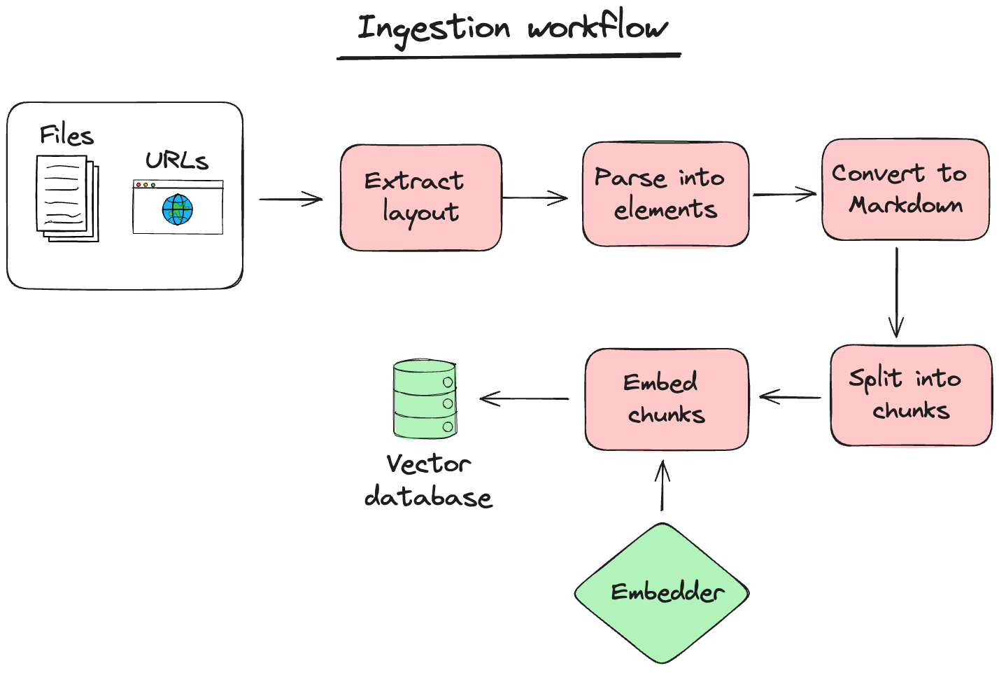

# Basic ingestion




Creating a basic ingestion workflow like the one above is simple, here are the steps:

1. Add your API Keys to your environment variables
```python
import os
os.environ["OPENAI_API_KEY"] = "myopenai_apikey"

```
Check our `.env.example` file to see the possible environment variables you can configure. Quivr supports APIs from Anthropic, OpenAI, and Mistral. It also supports local models using Ollama.

2. Create the YAML file ``basic_ingestion_workflow.yaml`` and copy the following content in it
```yaml
parser_config:
  megaparse_config:
    strategy: "auto" # for unstructured, it can be "auto", "fast", "hi_res", "ocr_only", see https://docs.unstructured.io/open-source/concepts/partitioning-strategies#partitioning-strategies
    pdf_parser: "unstructured"
  splitter_config:
    chunk_size: 400 # in tokens
    chunk_overlap: 100 # in tokens
```

3. Create a Brain using the above configuration and the list of files you want to ingest
```python
from quivr_core import Brain
from quivr_core.config import IngestionConfig

config_file_name = "./basic_ingestion_workflow.yaml"

ingestion_config = IngestionConfig.from_yaml(config_file_name)

processor_kwargs = {
    "megaparse_config": ingestion_config.parser_config.megaparse_config,
    "splitter_config": ingestion_config.parser_config.splitter_config,
}

brain = Brain.from_files(name = "my smart brain",
                        file_paths = ["./my_first_doc.pdf", "./my_second_doc.txt"],
                        processor_kwargs=processor_kwargs,
                        )

```

4. Launch a Chat
```python
brain.print_info()

from rich.console import Console
from rich.panel import Panel
from rich.prompt import Prompt

console = Console()
console.print(Panel.fit("Ask your brain !", style="bold magenta"))

while True:
    # Get user input
    question = Prompt.ask("[bold cyan]Question[/bold cyan]")

    # Check if user wants to exit
    if question.lower() == "exit":
        console.print(Panel("Goodbye!", style="bold yellow"))
        break

    answer = brain.ask(question)
    # Print the answer with typing effect
    console.print(f"[bold green]Quivr Assistant[/bold green]: {answer.answer}")

    console.print("-" * console.width)

brain.print_info()
```

5. You are now all set up to talk with your brain and test different chunking strategies by simply changing the configuration file!
