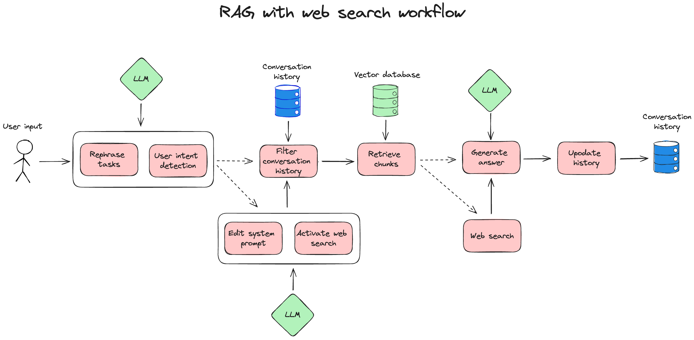

# RAG with web search




Follow the instructions below to create the agentic RAG workflow shown above, which includes some advanced capabilities such as:

* **user intention detection** - the agent can detect if the user wants to activate the web search tool to look for information not present in the documents;
* **dynamic chunk retrieval** - the number of retrieved chunks is not fixed, but determined dynamically using the reranker's relevance scores and the user-provided ``relevance_score_threshold``;
* **web search** - the agent can search the web for more information if needed.


---

1. Add your API Keys to your environment variables
```python
import os
os.environ["OPENAI_API_KEY"] = "my_openai_api_key"
os.environ["TAVILY_API_KEY"] = "my_tavily_api_key"

```
Check our `.env.example` file to see the possible environment variables you can configure. Quivr supports APIs from Anthropic, OpenAI, and Mistral. It also supports local models using Ollama.

2. Create the YAML file ``rag_with_web_search_workflow.yaml`` and copy the following content in it
```yaml
workflow_config:
  name: "RAG with web search"

  # List of tools that the agent can activate if the user instructions require it
  available_tools:
    - "web search"

  nodes:
    - name: "START"
      conditional_edge:
        routing_function: "routing_split"
        conditions: ["edit_system_prompt", "filter_history"]

    - name: "edit_system_prompt"
      edges: ["filter_history"]

    - name: "filter_history"
      edges: ["dynamic_retrieve"]

    - name: "dynamic_retrieve"
      conditional_edge:
        routing_function: "tool_routing"
        conditions: ["run_tool", "generate_rag"]

    - name: "run_tool"
      edges: ["generate_rag"]

    - name: "generate_rag" # the name of the last node, from which we want to stream the answer to the user
      edges: ["END"]
      tools:
        - name: "cited_answer"

# Maximum number of previous conversation iterations
# to include in the context of the answer
max_history: 10

# Number of chunks returned by the retriever
k: 40

# Reranker configuration
reranker_config:
  # The reranker supplier to use
  supplier: "cohere"

  # The model to use for the reranker for the given supplier
  model: "rerank-multilingual-v3.0"

  # Number of chunks returned by the reranker
  top_n: 5

  # Among the chunks returned by the reranker, only those with relevance
  # scores equal or above the relevance_score_threshold will be returned
  # to the LLM to generate the answer (allowed values are between 0 and 1,
  # a value of 0.1 works well with the cohere and jina rerankers)
  relevance_score_threshold: 0.01

# LLM configuration
llm_config:

  # maximum number of tokens passed to the LLM to generate the answer
  max_input_tokens: 8000

  # temperature for the LLM
  temperature: 0.7
```

3. Create a Brain with the default configuration
```python
from quivr_core import Brain

brain = Brain.from_files(name = "my smart brain",
                        file_paths = ["./my_first_doc.pdf", "./my_second_doc.txt"],
                        )

```

4. Launch a Chat
```python
brain.print_info()

from rich.console import Console
from rich.panel import Panel
from rich.prompt import Prompt
from quivr_core.config import RetrievalConfig

config_file_name = "./rag_with_web_search_workflow.yaml"

retrieval_config = RetrievalConfig.from_yaml(config_file_name)

console = Console()
console.print(Panel.fit("Ask your brain !", style="bold magenta"))

while True:
    # Get user input
    question = Prompt.ask("[bold cyan]Question[/bold cyan]")

    # Check if user wants to exit
    if question.lower() == "exit":
        console.print(Panel("Goodbye!", style="bold yellow"))
        break

    answer = brain.ask(question, retrieval_config=retrieval_config)
    # Print the answer with typing effect
    console.print(f"[bold green]Quivr Assistant[/bold green]: {answer.answer}")

    console.print("-" * console.width)

brain.print_info()
```

5. You are now all set up to talk with your brain and test different retrieval strategies by simply changing the configuration file!
